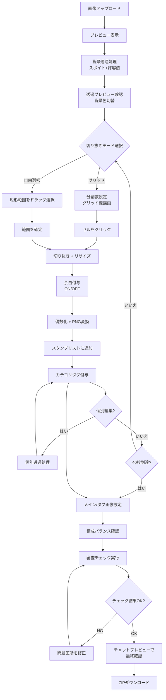
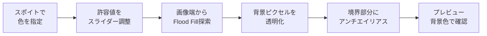
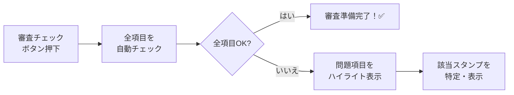

# LINE スタンプ作成ツール 設計書

> **バージョン**: v0.5
> **作成日**: 2026-02-28
> **ステータス**: 確定（UI改善・追加要望反映済み）

---

## 1. 概要

LINEスタンプ用の画像を効率的に作成するためのWebブラウザベースのツール。
ユーザーが画像をアップロードし、グリッド分割または自由選択で複数のスタンプ画像を切り出し、
背景透過処理を施したうえで、LINE公式フォーマットに準拠した形式で一括ダウンロードできる。
**さらに、審査リジェクト防止チェック、チャット風プレビュー、セット構成ガイドにより、
販売を見据えた高品質なスタンプセット制作をサポートする。**

### 1.1 技術スタック

| 項目 | 技術 |
|------|------|
| フロントエンド | HTML5 / CSS3 / Vanilla JavaScript |
| 画像処理 | Canvas API |
| ZIP生成 | JSZip（CDN経由） |
| ホスティング | ローカルファイル or 静的サーバー |

> [!NOTE]
> フレームワーク不使用。単一HTMLファイル（または少数ファイル構成）で動作させる。

---

## 2. LINE スタンプ仕様（公式準拠）

### 2.1 画像種別

| 種別 | サイズ | 枚数 | 用途 |
|------|--------|------|------|
| **スタンプ画像** | 横370px × 縦320px（最大） | 8/16/24/32/40枚 | トークで送受信される画像 |
| **メイン画像** | 240px × 240px | 1枚 | LINEストア・スタンプショップでセットの「顔」として表示 |
| **タブ画像** | 96px × 74px | 1枚 | トークルームのスタンプ選択アイコン |

### 2.2 共通フォーマットルール

| 項目 | 仕様 |
|------|------|
| ファイル形式 | PNG（背景**透過必須**） |
| ファイルサイズ | 1枚あたり 1MB 以下 |
| 解像度 | 72dpi 以上 |
| カラーモード | RGB |
| サイズ制約 | 幅・高さともに **偶数** であること |
| 余白 | 上下左右に **10px** の透明余白を推奨 |

> [!IMPORTANT]
> LINE公式仕様では**すべての画像の背景が透過（透明）である必要がある**。
> 白い背景が残っているとダークモードなどで表示に問題が生じる。
> → 本ツールの「色指定透過」機能は仕様上も必須機能。

---

## 3. 機能一覧

### 3.1 画像アップロード（複数画像対応）

- ドラッグ＆ドロップ、またはファイル選択ダイアログで画像を読み込む
- 対応形式: PNG, JPEG, WebP
- **複数画像の切り替えに対応**:
  - 複数画像をアップロード可能、サイドバーでサムネイル一覧を表示
  - アクティブ画像を切り替えてそれぞれからスタンプを切り出せる
  - スタンプリスト（最大40枚）は全画像で共有

> [!NOTE]
> **複数画像対応を採用する理由**: スタンプセットは通常、異なるイラスト素材から構成される。
> 1枚の画像からしか切り出せないと、毎回画像を差し替える手間が発生するが、
> 複数画像を保持してタブ切り替えで作業できれば効率が大幅に向上する。

### 3.2 背景透過処理（色指定透過）

画像アップロード直後に、背景色を透過する処理を行う。

#### 3.2.1 透過処理のロジック

- **色の指定方法**: プレビュー画像上をクリックして透過したい色を取得（スポイト）
- **許容値（Tolerance）**: スライダーで 0〜100 の範囲で調整
  - 指定色との色差（RGB各チャンネルの差の絶対値合計）が許容値以内のピクセルを透過
- **背景のみ透過（Flood Fill 方式）**:
  - 画像の端（上下左右の辺）から連続する同色領域のみを透過
  - イラストの実線で囲まれた内部領域は保護される
  - つまり、単純な全ピクセル置換ではなく、**端から塗りつぶし方式**で背景を検出
- **アンチエイリアス処理**:
  - 透過境界のピクセルに対して、元の色と透明のブレンドを適用
  - 境界の透明度を段階的に変化させ、ジャギーを軽減

#### 3.2.2 透過プレビュー

- プレビュー背景色を切り替えて透過状態を確認（保存画像には反映しない）
  - **市松模様**（デフォルト、一般的な透過表現）
  - **緑（クロマキーグリーン）**: `#00FF00`
  - **青（クロマキーブルー）**: `#0000FF`
  - **白**: `#FFFFFF`
  - **黒**: `#000000`

### 3.3 グリッド分割設定

- **横分割数**: スライダーで指定（1〜10の範囲）
- **縦分割数**: スライダーで指定（1〜10の範囲）
- スライダー上での **マウスホイール操作（スクロール）** による直感的な値の増減に対応
- プレビュー画像上にリアルタイムでグリッド線を描画
- グリッド線の色・透明度は視認性を考慮（赤色、半透明）
- 各セルのサイズ（px）をリアルタイム表示

### 3.4 画像切り抜き（2モード）

#### モード1: グリッド切り抜き
- グリッド上の任意のセルをクリックして切り抜き
- 切り抜き済みのセルは視覚的にマーキング（半透明オーバーレイ）
- **同じセルの再切り抜きは不可**（スキップ）

#### モード2: 自由選択切り抜き
- 任意の矩形範囲を選択して切り抜くモード
- **操作方法の切り替え**:
  - **ドラッグ方式**: マウスボタンを押し込んだまま移動し、離して確定
  - **2点クリック方式**: 始点を1回クリックし、終点でもう1回クリックして確定（ドラッグが苦手な環境向け）
- 選択範囲のプレビューをリアルタイム表示

#### リサイズ方式の選択（新規追加）
切り抜いた画像を LINE 指定の枠（370px × 320px等）にどのように収めるかを選択可能。
- **比率維持（余白追加）**: 元の縦横比を一切崩さず、足りない部分を透明な余白で埋める（デフォルト）
- **枠に合わせる（比率変更）**: 枠いっぱいに画像を引き伸ばす。余白は出ないが縦横比は崩れる
- **枠いっぱい（はみ出しカット）**: 余白が出ないように画像を拡大し、はみ出た部分を自動で切り捨てる

#### 共通処理
- 最大 **40枚** まで切り抜き可能

### 3.5 余白（マージン）処理

- **デフォルト**: LINE推奨の **10px透明余白** を自動付与（ON）
- トグルスイッチで余白の ON/OFF を切り替え可能
- 余白ONの場合:
  - 実際の描画領域は 350px × 300px になり、周囲10pxが透明余白
  - アスペクト比を保持した上で描画領域にフィット

### 3.6 スタンプリスト管理

- 切り抜いた画像をリスト形式で表示（サムネイル + 番号）
- リスト内の画像に対して以下の操作が可能:
  - **削除**: 個別に削除
  - **並び替え**: ドラッグ＆ドロップで順番変更
  - **個別編集**: クリックで個別編集モーダルを開く
  - **プレビュー**: ホバーで拡大プレビュー
- 現在の枚数 / 最大枚数を表示（例: `12 / 40`）

### 3.7 個別編集機能

スタンプリスト内の各画像に対して、モーダルウィンドウで個別に編集できる。

- **色指定透過**: 3.2 と同じロジック（スポイトで色選択 + 許容値スライダー）
  - ※許容値スライダー部分もマウスホイール操作に対応
- **プレビュー背景切替**: 市松模様 / 緑 / 青 / 白 / 黒
- **プレビュー表示**: 大きく表示して細部確認可能
- 編集完了で「適用」ボタン、キャンセルで元に戻る

### 3.8 メイン画像・タブ画像の生成

- **メイン画像**（240×240px）: スタンプリストから1枚を選択して自動リサイズ
- **タブ画像**（96×74px）: スタンプリストから1枚を選択して自動リサイズ
- ZIPダウンロード時に `main.png`, `tab.png` として含める

> [!NOTE]
> **タブ画像が使われる場面**: LINEアプリのトークルームでスタンプ選択バーに小さなアイコン
> として表示される。非常に小さいため、キャラクターの顔のアップなどシンプルなデザインが推奨。
> **メイン画像が使われる場面**: LINEストアやスタンプショップでスタンプセットの「顔」として
> 表示される。ユーザーがスタンプを購入する際に最初に目にする画像。

### 3.9 Undo（元に戻す）機能

- **操作履歴をスタック管理**して、直前の操作を元に戻せる（Ctrl+Z / Cmd+Z 対応）
- 対象となる操作:
  - 画像の切り抜き（追加）
  - スタンプの削除
  - スタンプの並び替え
  - 透過処理の適用
  - 個別編集の適用
- 履歴の最大保持数: **20件**（メモリ節約のため上限設定）

### 3.10 画像フォーマット変換

切り抜き時に自動実行する処理:

1. **リサイズ**: 370px × 320px に収まるように縮小（アスペクト比保持）
2. **余白付与**: ON の場合 10px の透明余白を付与
3. **偶数化**: 幅・高さが奇数なら1px縮小
4. **PNG変換**: Canvas API の `toBlob()` で PNG 出力
5. **ファイルサイズチェック**: 1MB超の場合は画質調整 → 警告

### 3.11 審査リジェクト防止チェック

スタンプ完成後に「審査チェック」ボタンで一括診断し、LINE Creators Market の審査で
リジェクトされる可能性のある問題を事前に検出する。

#### チェック項目一覧

| # | チェック項目 | 内容 | 重要度 |
|---|-------------|------|--------|
| 1 | 透過チェック | 背景が完全に透過されているか（白残りの検出） | 🔴 必須 |
| 2 | サイズ・偶数チェック | 規定サイズ内 & 幅高さが偶数であるか | 🔴 必須 |
| 3 | 余白チェック | 上下左右に10px以上の余白があるか | 🔴 必須 |
| 4 | ファイルサイズ | 各画像が1MB以下か | 🔴 必須 |
| 5 | 枚数チェック | 8/16/24/32/40 の公式セット数に合致しているか | 🔴 必須 |
| 6 | メイン/タブ画像 | 設定されているか | 🟡 推奨 |
| 7 | 視認性チェック | 暗い背景・明るい背景の両方で視認できるか（自動判定） | 🟡 推奨 |

#### 結果表示

- 各項目に ✅ OK / ⚠️ 警告 / ❌ NG のステータスを表示
- NG 項目がある場合は該当スタンプをハイライトして問題箇所を明示
- 全項目 OK の場合は「審査準備完了！」と表示

### 3.12 LINEチャット風プレビュー

スタンプが実際のLINEトーク画面でどのように見えるかをモックアップで確認できる。

#### 機能詳細

- **ライトモード / ダークモード** の切り替えに対応
- スタンプリストから任意の画像をクリックしてプレビュー画面に配置
- LINEのトーク吹き出しデザインを模した UI で表示
- **スマホ実寸に近いサイズ感**で確認可能（画面幅を375px前後で表示）
- スタンプの送信側・受信側を切り替え可能

#### 確認できるポイント

- スタンプが小さすぎないか（可読性）
- ダークモードで背景と同化しないか
- 吹き出しとの調和
- 他のスタンプとの並び感

### 3.13 スタンプセット構成ガイド

売れるスタンプセットに必要なカテゴリバランスを可視化し、構成の偏りを防ぐ。

#### カテゴリ一覧

| カテゴリ | 説明 | 推奨割合 |
|----------|------|----------|
| あいさつ | おはよう、こんにちは、おやすみ等 | 15〜20% |
| 感情（喜） | うれしい、やったー、ありがとう等 | 10〜15% |
| 感情（怒） | 怒り、イライラ等 | 5〜10% |
| 感情（哀） | 悲しい、ごめんね等 | 5〜10% |
| 感情（楽） | 笑い、ウケる等 | 10〜15% |
| リアクション | OK、了解、なるほど等 | 15〜20% |
| 日常会話 | がんばれ、おつかれ、いいね等 | 15〜20% |
| 季節・イベント | 正月、誕生日、クリスマス等 | 5〜10% |

#### 操作

- 各スタンプにワンクリックでカテゴリタグをドロップダウンから付与
- バランスチャート（棒グラフ）をリアルタイム表示
- 公式セット数（8/16/24/32/40）に対する過不足を表示
- 不足カテゴリに対して「💡 ○○カテゴリを追加すると、バランスが良くなります」とアドバイス表示

### 3.14 プロジェクト保存・復元

作業途中の状態をブラウザの localStorage に保存し、後から再開できる。

- **自動保存**: 切り抜き・編集のたびに自動で保存（デバウンス付き）
- **手動保存**: 「保存」ボタンで即時保存
- **復元**: ページ再読み込み時に「前回の続きから再開しますか？」と確認
- **保存データ**:
  - スタンプリスト（画像データ + カテゴリタグ + 順番）
  - グリッド設定値
  - 透過処理の設定値
  - メイン/タブ画像の選択状態
- **容量制限**: localStorage は約 5MB のため、保存可能なスタンプ数を表示
- **エクスポート/インポート**: JSON ファイルとしてプロジェクトを書き出し・読み込みも対応

> [!WARNING]
> localStorage はブラウザのキャッシュクリアで消える可能性がある。
> 「JSONエクスポートでバックアップを取ってください」と UI 上で注意表示する。

### 3.15 ZIP ダウンロード

- リスト内の全画像を ZIP ファイルにまとめてダウンロード（Blob読み込み方式で安定性向上済み）
- ファイル構成:
  ```
  line_stamps_YYYYMMDD_HHmmss.zip
  ├── main.png          # メイン画像 (240×240)
  ├── tab.png           # タブ画像 (96×74)
  ├── 01.png            # スタンプ画像
  ├── 02.png
  ├── ...
  └── 40.png
  ```
- JSZip ライブラリを使用

### 3.16 使い方ガイド（HowToモーダル）

ツールを初めて使うユーザー（中学生等の初心者層含む）に向けた、分かりやすい使い方の説明画面。

- ヘッダーの「📖 使い方」ボタンからいつでも呼び出し可能
- 以下のステップを分かりやすく解説:
  1. 画像のアップロード
  2. 背景の透過処理と設定
  3. 切り抜き設定（グリッド/自由選択、リサイズ、余白など）
  4. メイン画像・タブ画像・ZIPダウンロードまでの流れ
- ウォーターマーク対策（Gemini等のロゴ）として、自由選択を用いた切り抜き方法も併記。

---

## 4. 画面構成

### 4.1 メイン画面

```
┌──────────────────────────────────────────────────────────────┐
│  ヘッダー: 💬 LINE スタンプメーカー   [📖 使い方] [Undo] [Redo]   │
├──────────────────────────────────────────────────────────────┤
│ 画像タブ: [画像1] [画像2] [画像3] [+ 画像追加]                │
├─────────────────────────────────────┬────────────────────────┤
│                                     │                        │
│   ┌─────────────────────────────┐   │  📋 スタンプリスト        │
│   │                             │   │  ┌────────────────┐    │
│   │                             │   │  │[01🏷] [02🏷]    │    │
│   │    画像プレビューエリア      │   │  │[03🏷] [04🏷]    │    │
│   │    （大きく表示）            │   │  │[05🏷] [06🏷]    │    │
│   │    + グリッド線 / 自由選択   │   │  │  ...             │    │
│   │                             │   │  │ 8 / 40 枚       │    │
│   │                             │   │  └────────────────┘    │
│   └─────────────────────────────┘   │                        │
│                                     │  📊 構成バランス         │
│  🎨 透過処理                         │  あいさつ ████░ 3枚    │
│  [スポイト] 許容値: [====●==] 30    │  感情(喜) ██░░░ 2枚    │
│  プレビュー背景: [市松][緑][青]     │  リアクション ██░░ 1枚  │
│                                     │  💡 感情(怒) を追加推奨 │
│  ✂️ 切り抜き設定                      │                        │
│  モード: [グリッド | 自由選択]       │  [メイン画像を設定]     │
│  横: [===●===] 4  縦: [===●===] 3  │  [タブ画像を設定]      │
│  リサイズ: [比率維持(余白) ▼]       │  [審査チェック🔍]      │
│  余白: [ON / OFF]                   │  [チャットプレビュー💬] │
│                                     │  [全削除]              │
│                                     │  [ZIPダウンロード📦]   │
├─────────────────────────────────────┴────────────────────────┤
│  ステータスバー: メッセージ表示                               │
└──────────────────────────────────────────────────────────────┘
```

### 4.2 個別編集モーダル

```
┌──────────────────────────────────────────────┐
│  個別編集: スタンプ #05              [✕ 閉じ] │
├──────────────────────────────────────────────┤
│                                              │
│   ┌──────────────────────────────────┐       │
│   │                                  │       │
│   │   画像プレビュー（大きく表示）    │       │
│   │                                  │       │
│   └──────────────────────────────────┘       │
│                                              │
│   透過処理:                                   │
│   [スポイト] 許容値: [====●==] 30             │
│   プレビュー背景: [市松][緑][青][白][黒]      │
│                                              │
│          [キャンセル]  [適用]                  │
└──────────────────────────────────────────────┘
```

### 4.3 審査チェック結果モーダル

```
┌──────────────────────────────────────────────────┐
│  審査チェック結果                        [✕ 閉じ] │
├──────────────────────────────────────────────────┤
│                                                  │
│  ✅ 透過チェック          すべて背景透過済み      │
│  ✅ サイズ・偶数チェック  370×320 偶数OK          │
│  ✅ 余白チェック          10px以上の余白あり       │
│  ✅ ファイルサイズ        全画像 1MB以下           │
│  ❌ 枚数チェック          22枚 → 24枚にしてください│
│  ⚠️ メイン/タブ画像       タブ画像が未設定         │
│  ✅ 視認性チェック        ライト/ダーク両対応       │
│                                                  │
│  ─── 問題のあるスタンプ ───                       │
│  なし                                            │
│                                                  │
│  結果: ⚠️ 2件の修正が必要です                     │
│                                                  │
└──────────────────────────────────────────────────┘
```

### 4.4 チャット風プレビューモーダル

```
┌────────────────────────────────────────────────────┐
│ チャットプレビュー   [ライト/ダーク]       [✕ 閉じ] │
├────────────────────────────────────────────────────┤
│  ┌──────────────────────────────┐                  │
│  │ ┌──────────────────────┐    │                  │
│  │ │  LINE トーク          │    │                  │
│  │ ├──────────────────────┤    │                  │
│  │ │        こんにちは！ 💬│    │                  │
│  │ │                      │    │                  │
│  │ │  [スタンプ画像]       │    │                  │
│  │ │                      │    │                  │
│  │ │    OK！ 💬           │    │                  │
│  │ │                      │    │                  │
│  │ │          [スタンプ]  →│    │                  │
│  │ │                既読  │    │                  │
│  │ └──────────────────────┘    │                  │
│  └──────────────────────────────┘                  │
│                                                    │
│  スタンプを選択: リストからクリックで配置            │
│  表示側: [送信 | 受信]                              │
└────────────────────────────────────────────────────┘
```

### 4.5 レイアウト詳細

| エリア | 説明 |
|--------|------|
| ヘッダー | ツール名 + Undo/Redo ボタン |
| 画像タブバー | アップロード済み画像の切り替えタブ + 追加ボタン |
| 画像プレビューエリア（左・大） | アップロード画像の大きな表示、グリッド線 or 自由選択の描画 |
| 透過処理コントロール（左下） | スポイト、許容値スライダー、プレビュー背景切替 |
| 切り抜きコントロール（左下） | モード切替、分割数スライダー、余白トグル |
| スタンプリストエリア（右上） | 切り抜き済み画像のサムネイル一覧（ドラッグ並び替え + カテゴリタグ対応） |
| 構成バランス表示（右中） | カテゴリ別の棒グラフ + アドバイス |
| アクションボタン（右下） | メイン/タブ画像設定、審査チェック、チャットプレビュー、全削除、ZIPダウンロード |
| ステータスバー | 処理状況のフィードバック表示 |

---

## 5. ファイル構成

```
2026-02-28_LINE_sutanpu/
├── index.html              # メインHTML（エントリーポイント）
├── style.css               # スタイルシート
├── app.js                  # メインアプリケーション + 状態管理
├── modules/
│   ├── imageLoader.js      # 画像アップロード・複数画像管理
│   ├── gridManager.js      # グリッド分割・描画管理
│   ├── freeSelect.js       # 自由選択切り抜き
│   ├── cropper.js          # 画像切り抜き・リサイズ処理
│   ├── transparency.js     # 背景透過処理（Flood Fill + アンチエイリアス）
│   ├── stampList.js        # スタンプリスト管理（D&D並び替え含む）
│   ├── stampEditor.js      # 個別編集モーダル
│   ├── undoManager.js      # Undo/Redo 履歴管理
│   ├── marginProcessor.js  # 余白付与処理
│   ├── reviewChecker.js    # 審査リジェクト防止チェック
│   ├── chatPreview.js      # LINEチャット風プレビュー
│   ├── categoryGuide.js    # スタンプセット構成ガイド
│   └── zipExport.js        # ZIP生成・ダウンロード処理
├── lib/
│   └── jszip.min.js        # JSZip ライブラリ
└── 設計書.md               # 本ファイル
```

---

## 6. 処理フロー

### 6.1 メインフロー



### 6.2 背景透過処理フロー



### 6.3 審査チェックフロー



---

## 7. 主要モジュール仕様

### 7.1 transparency.js（新規・重要）

| 関数名 | 引数 | 戻り値 | 説明 |
|--------|------|--------|------|
| `pickColor(imageData, x, y)` | ImageData, number×2 | {r,g,b} | 指定座標の色を取得 |
| `floodFillTransparent(imageData, targetColor, tolerance)` | ImageData, Color, number | ImageData | 端から Flood Fill で背景を透過 |
| `applyAntiAlias(imageData, boundaryPixels)` | ImageData, Set | ImageData | 境界ピクセルにアンチエイリアス適用 |
| `isWithinTolerance(color1, color2, tolerance)` | Color×2, number | boolean | 2色の差が許容値内か判定 |

### 7.2 freeSelect.js（新規）

| 関数名 | 引数 | 戻り値 | 説明 |
|--------|------|--------|------|
| `startSelection(canvas, x, y)` | Canvas, number×2 | void | 自由選択の開始点を記録 |
| `updateSelection(x, y)` | number×2 | void | 選択範囲を更新（リアルタイムプレビュー） |
| `endSelection(x, y)` | number×2 | {x,y,w,h} | 選択範囲を確定して矩形を返す |

### 7.3 undoManager.js（新規）

| 関数名 | 引数 | 戻り値 | 説明 |
|--------|------|--------|------|
| `pushState(action, data)` | string, any | void | 操作をスタックに追加 |
| `undo()` | なし | Action \| null | 直前操作を取り消し |
| `redo()` | なし | Action \| null | 取り消した操作をやり直し |
| `canUndo()` | なし | boolean | Undo可能か |
| `canRedo()` | なし | boolean | Redo可能か |

### 7.4 stampEditor.js（新規）

| 関数名 | 引数 | 戻り値 | 説明 |
|--------|------|--------|------|
| `openEditor(stampIndex)` | number | void | 個別編集モーダルを開く |
| `applyEdit(stampIndex, editedImageData)` | number, ImageData | void | 編集結果を反映 |
| `cancelEdit()` | なし | void | 編集をキャンセルして元に戻す |

### 7.5 reviewChecker.js（新規）

| 関数名 | 引数 | 戻り値 | 説明 |
|--------|------|--------|------|
| `runAllChecks(stamps, mainImg, tabImg)` | Blob[], Blob, Blob | CheckResult[] | 全チェック項目を実行 |
| `checkTransparency(stamp)` | Blob | {ok, details} | 背景の白残りを検出 |
| `checkSize(stamp)` | Blob | {ok, details} | サイズ・偶数チェック |
| `checkMargin(stamp)` | Blob | {ok, details} | 余白が10px以上あるか |
| `checkFileSize(stamp)` | Blob | {ok, details} | 1MB以下か |
| `checkCount(count)` | number | {ok, details} | 公式セット数に合致するか |
| `checkVisibility(stamp)` | Blob | {ok, details} | 明暗背景での視認性チェック |

### 7.6 chatPreview.js（新規）

| 関数名 | 引数 | 戻り値 | 説明 |
|--------|------|--------|------|
| `openChatPreview()` | なし | void | チャットプレビューモーダルを開く |
| `addStampToChat(stampBlob, side)` | Blob, 'send'\|'receive' | void | プレビューにスタンプを配置 |
| `toggleDarkMode(isDark)` | boolean | void | ライト/ダークモード切替 |
| `clearChat()` | なし | void | プレビューをクリア |

### 7.7 categoryGuide.js（新規）

| 関数名 | 引数 | 戻り値 | 説明 |
|--------|------|--------|------|
| `setCategory(stampIndex, category)` | number, string | void | スタンプにカテゴリを付与 |
| `getBalanceChart()` | なし | CategoryBalance[] | カテゴリ別の枚数と割合を返す |
| `getSuggestions(balance)` | CategoryBalance[] | string[] | 構成改善アドバイスを生成 |
| `getRecommendedSetSize(count)` | number | number | 最適な公式セット数を提案 |

### 7.8 既存モジュール

| モジュール | 変更点 |
|-----------|--------|
| `imageLoader.js` | 複数画像管理、タブ切り替え機能を追加 |
| `gridManager.js` | 変更なし |
| `cropper.js` | 自由選択モードとの連携を追加 |
| `stampList.js` | D&D並び替え、個別編集ボタン、カテゴリタグ表示、メイン/タブ画像選択を追加 |
| `marginProcessor.js` | 新規: 10px 余白付与処理 |
| `zipExport.js` | `main.png`, `tab.png` の出力を追加 |

---

## 8. UIデザイン方針

### 8.1 デザインコンセプト

- **ダークモード**ベースのモダンUI
- グラスモーフィズムを活用したカードデザイン
- スムーズなアニメーションとトランジション
- 直感的な操作（ドラッグ＆ドロップ、ワンクリック切り抜き）
- **プレビューエリアを大きく確保**（作業しやすさ重視）

### 8.2 カラーパレット

| 用途 | 色 | カラーコード |
|------|----|-------------|
| 背景（メイン） | ダークグレー | `#1a1a2e` |
| 背景（カード） | セミダーク | `#16213e` |
| アクセント | LINEグリーン | `#06C755` |
| アクセント（ホバー） | ライトグリーン | `#08E065` |
| テキスト（主） | ホワイト | `#e8e8e8` |
| テキスト（副） | グレー | `#a0a0b0` |
| グリッド線 | 赤（半透明） | `rgba(255, 80, 80, 0.7)` |
| 切り抜き済みマーク | 緑（半透明） | `rgba(6, 199, 85, 0.3)` |
| 警告 | オレンジ | `#ff9800` |
| エラー | レッド | `#ff5252` |

### 8.3 フォント

- **メイン**: `'Inter', 'Noto Sans JP', sans-serif`（Google Fonts）
- **数値**: `'JetBrains Mono', monospace`

---

## 9. エラーハンドリング

| エラーケース | 対処 |
|-------------|------|
| 非対応形式のファイルをアップロード | 警告メッセージ表示、処理中断 |
| 切り抜き後のファイルサイズが1MB超 | 画質を段階的に下げて再生成、それでもダメなら警告 |
| 40枚上限に到達 | 切り抜き操作を無効化、メッセージ表示 |
| 切り抜き済みセルをクリック | 視覚的フィードバック（セルが一瞬光る等） |
| 画像の読み込み失敗 | エラーメッセージ表示 |
| ZIPダウンロード失敗 | リトライ案内 |
| メイン/タブ画像未設定でZIP出力 | 警告表示、未設定でもDL可能にする |
| Undo履歴が空の状態でUndoを実行 | ボタン無効化 + ステータスバー通知 |

---

## 10. セキュリティ

> [!CAUTION]
> 本ツールは初心者がネット上に公開する可能性がある。
> 以下の方針を**全コードで厳守**すること。

### 10.1 基本方針: 完全クライアントサイド処理

- **すべての画像処理はブラウザ内（Canvas API）で完結**させる
- 外部サーバーへの画像送信は**一切行わない**
- ユーザーの画像データがネットワークを経由することは**絶対にない**
- HTMLファイルを開くだけで動作し、バックエンドサーバーは不要

### 10.2 外部リソースの安全性

| 対策 | 内容 |
|------|------|
| JSZip の読み込み | CDN使用時は **SRI（Subresource Integrity）ハッシュ** を必ず付与。改ざん検知が可能になる |
| Google Fonts | フォント読み込みのみ。トラッキングなし。`display=swap` 指定でフォールバック確保 |
| その他の外部JS | **一切読み込まない**。必要なライブラリはローカルに同梱する |

```html
<!-- SRI付きCDN読み込みの例 -->
<script src="https://cdn.jsdelivr.net/npm/jszip@3/dist/jszip.min.js"
        integrity="sha384-xxxxxx"
        crossorigin="anonymous"></script>
```

### 10.3 入力値のバリデーション

| 対象 | バリデーション |
|------|--------------|
| アップロードファイル | MIMEタイプ（image/png, image/jpeg, image/webp）を検証。拡張子だけでなく**ファイルヘッダ**も確認 |
| ファイルサイズ | アップロード時に上限チェック（例: 50MB以上は拒否） |
| スライダー値 | 最小値・最大値の範囲を `min`/`max` 属性で厳格に制限 |
| ファイル名 | ZIPエクスポート時、ファイル名に**ユーザー入力を含めない**（連番 `01.png` 〜 `40.png` 固定） |

### 10.4 XSS・インジェクション対策

- **`innerHTML` は使用禁止** → `textContent` または `createElement` を使用
- ユーザー入力文字列を DOM に挿入する際は必ずエスケープ処理
- `eval()` は**絶対に使用しない**
- Content Security Policy（CSP）をHTMLの `<meta>` タグで設定:

```html
<meta http-equiv="Content-Security-Policy"
      content="default-src 'self';
               script-src 'self' https://cdn.jsdelivr.net;
               style-src 'self' 'unsafe-inline' https://fonts.googleapis.com;
               font-src https://fonts.gstatic.com;
               img-src 'self' blob: data:;">
```

### 10.5 データの保護

| 対策 | 内容 |
|------|------|
| localStorage | プロジェクト保存に使用する場合、**機密情報は保存しない**。画像データのみ |
| Cookie | **一切使用しない** |
| トラッキング | Google Analytics 等の外部トラッキングは**一切入れない** |
| サードパーティ | 広告・SNSウィジェット等の埋め込みは**一切行わない** |

### 10.6 安全なファイル処理

- Canvas API の `toBlob()` / `toDataURL()` でPNG生成（ブラウザネイティブ処理）
- `URL.createObjectURL()` で生成した Blob URL は、使用後に`URL.revokeObjectURL()` で**必ず解放**
- 巨大画像のアップロード時は Web Worker での処理を検討（UIフリーズ防止）

### 10.7 公開時の注意事項（READMEに記載）

ツールを公開する際に同梱するREADMEに以下を明記:

- 「画像データはサーバーに送信されません。すべてブラウザ内で処理されます」
- 「インターネット接続はフォント読み込みとJSZipライブラリにのみ使用されます」
- 「オフラインでも動作します（ローカルファイル同梱版の場合）」

---

## 11. 決定済み事項

| # | 項目 | 決定内容 |
|---|------|---------|
| 1 | 複数画像対応 | ✅ 複数画像をタブ切り替えで使用可能 |
| 2 | 並び替え | ✅ ドラッグ＆ドロップで並び替え対応 |
| 3 | 余白処理 | ✅ 10px余白をデフォルトON、トグルで切替 |
| 4 | メイン/タブ画像 | ✅ 両方作成対応（リストから選択→自動リサイズ） |
| 5 | 自由選択切り抜き | ✅ グリッドモードに加え、自由選択モードも実装 |
| 6 | 背景透過 | ✅ スポイト＋許容値＋Flood Fill方式 |
| 7 | 個別編集 | ✅ 切り抜き後の個別透過処理対応 |
| 8 | Undo | ✅ Ctrl/Cmd+Z で直前操作を取り消し可能 |
| 9 | 審査チェック | ✅ 7項目の自動診断でリジェクト防止 |
| 10 | チャット風プレビュー | ✅ ライト/ダーク両モードで実使用感を確認 |
| 11 | 構成ガイド | ✅ カテゴリタグ + バランスチャート + アドバイス |
| 12 | プロジェクト保存 | ✅ 自動保存 + JSONエクスポート/インポート |
| 13 | セキュリティ | ✅ 完全クライアントサイド + CSP + XSS対策 |

---

## 12. 今後の検討事項

  - 操作性向上: スライダーのホイール（スクロール）調整対応
  - モラル向上/サポート: 「使い方」ガイド（初心者・仕様理解用）の追加
  - サポート向上: 自由選択モードの（ドラッグ/2点クリック）切り替え
  - サポート向上: リサイズのアスペクト比変更モード（fit/cover）の実装
- [ ] 画像のトリミング・回転機能
- [ ] テキスト・絵文字の追加機能
- [ ] LINE Creators Market へのAPI連携

---

## 13. 開発完了状況

| フェーズ | 内容 | 完了状況 |
|---------|------|---------|
| Phase 1 | 基本UI + 画像アップロード + プレビュー + 複数画像対応 | ✅ |
| Phase 2 | 背景透過処理（Flood Fill + アンチエイリアス） | ✅ |
| Phase 3 | グリッド分割 + 自由選択 + 切り抜き処理 + 余白/リサイズ仕様拡張 | ✅ |
| Phase 4 | スタンプリスト管理 + D&D並び替え + 個別編集 | ✅ |
| Phase 5 | Undo/Redo + メイン/タブ画像 + ZIPダウンロード（安定化含む） | ✅ |
| Phase 6 | 審査チェック + チャット風プレビュー + 構成ガイド | ✅ |
| Phase 7 | プロジェクト保存 + セキュリティ対策 + CSP設定 | ✅ |
| Phase 8 | 追加要望（使い方ガイド等） + 総合テスト + 仕上げ完成 | ✅ |
